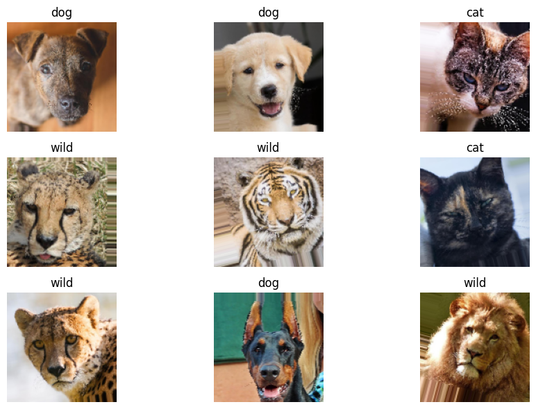
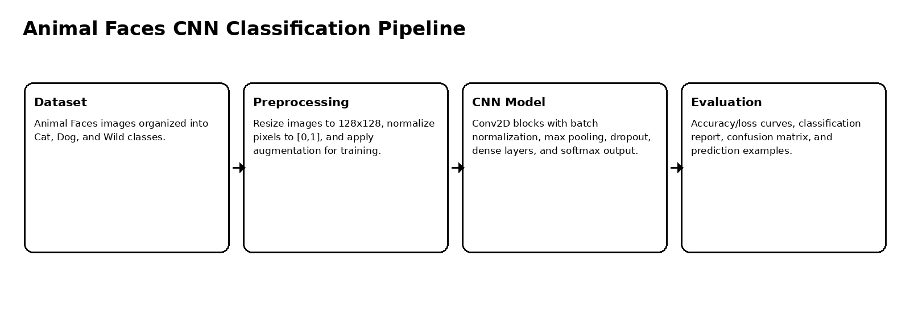
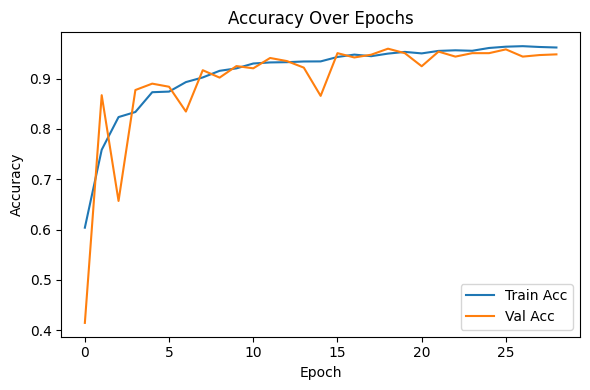
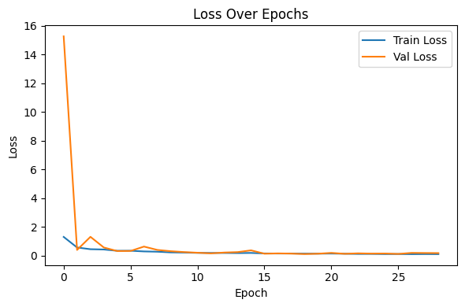
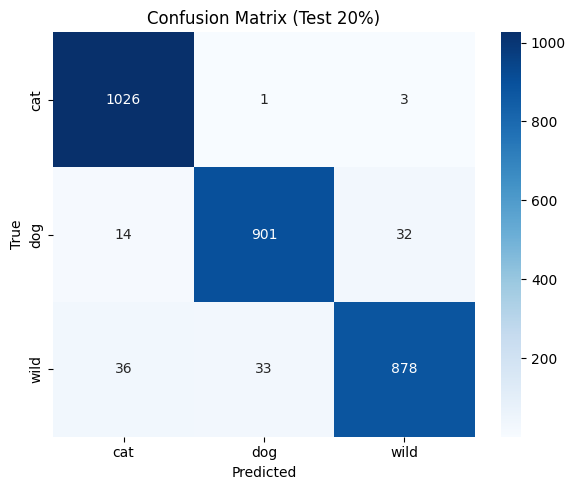
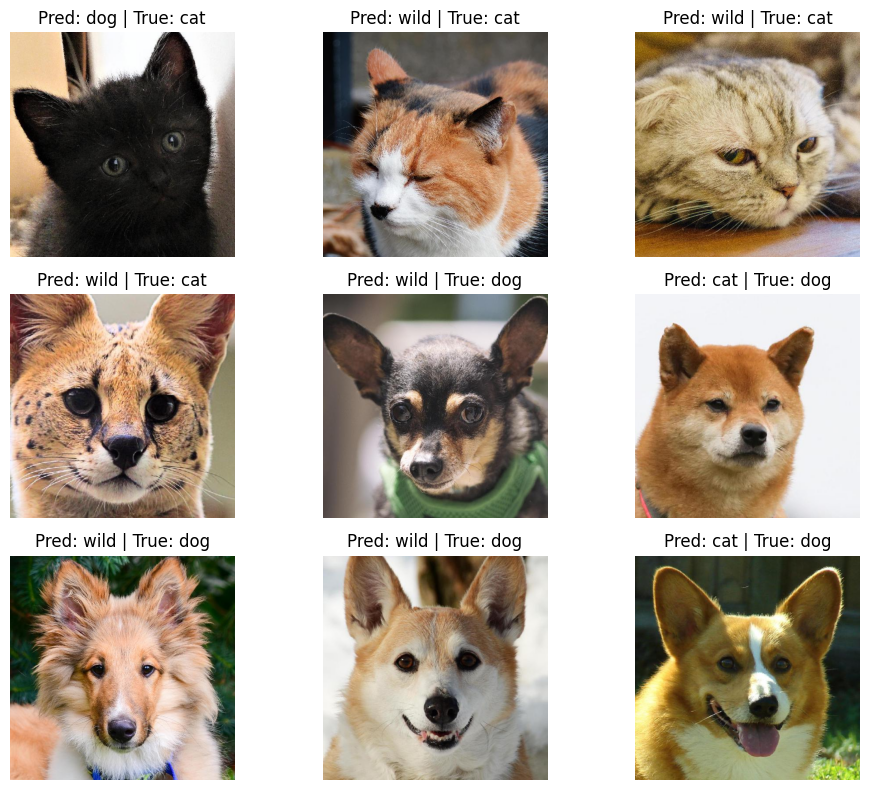

# Animal Faces CNN Classification

Convolutional neural network workflow for classifying animal face images into Cat, Dog, and Wild categories.

## Overview

This project trains a CNN image classifier on the Animal Faces dataset. The workflow includes image loading, preprocessing, augmentation, CNN design, callback-based training, evaluation, and visual error inspection.

## Dataset

| Item | Details |
|---|---|
| Dataset | Animal Faces |
| Source | Kaggle Animal Faces dataset |
| Classes | Cat, Dog, Wild |
| Image size | 128 × 128 |
| Training images | 11,706 |
| Test / validation images | 2,924 |
| Normalization | Pixel values scaled to [0, 1] |



## Modeling Workflow



The CNN architecture uses stacked convolutional blocks with max pooling, batch normalization, and dropout. Training uses `EarlyStopping`, `ReduceLROnPlateau`, and checkpointing to stabilize convergence and prevent overfitting.

## Model Configuration

| Component | Configuration |
|---|---|
| Input | 128×128 RGB image |
| Convolution blocks | 2 blocks with 32 and 64 filters |
| Kernel size | 3×3 |
| Pooling | 2×2 MaxPooling |
| Activation | ReLU |
| Output | 3-class softmax |
| Optimizer | Adam |
| Batch size | 32 |
| Training budget | 30 epochs with callbacks |

## Results

| Class | Precision | Recall | F1-score | Support |
|---|---:|---:|---:|---:|
| Cat | 0.9535 | 0.9961 | 0.9744 | 1,030 |
| Dog | 0.9636 | 0.9514 | 0.9575 | 947 |
| Wild | 0.9617 | 0.9271 | 0.9441 | 947 |
| **Overall accuracy** |  |  | **0.9593** | 2,924 |

## Interpretation

The model achieved 95.93% accuracy with balanced precision and recall across the three classes. Cat classification was the strongest, while Wild had slightly lower recall, reflecting visually diverse species and more challenging intra-class variation.

The training curves show stable convergence and no severe overfitting, with training and validation accuracy closely aligned near the end of training.

## Visual Summary

| Accuracy curve | Loss curve |
|---|---|
|  |  |

| Confusion matrix | Prediction examples |
|---|---|
|  |  |

## Repository Contents

```text
.
├── animal_faces_cnn_classification.ipynb
├── docs/
│   └── figures/
├── requirements.txt
├── .gitignore
└── README.md
```

## Run Locally

This repository is notebook-based. Create a clean Python environment, install the dependencies, then open the notebook.

### Windows PowerShell

```powershell
py -3.10 -m venv .venv
.\.venv\Scripts\Activate.ps1
python -m pip install --upgrade pip
pip install -r requirements.txt
```

### Linux / macOS

```bash
python3 -m venv .venv
source .venv/bin/activate
python -m pip install --upgrade pip
pip install -r requirements.txt
```


## Open the Notebook

```bash
jupyter notebook animal_faces_cnn_classification.ipynb
```

## Notes

The notebook expects the dataset to be available locally. The dataset itself is not included in this repository.
